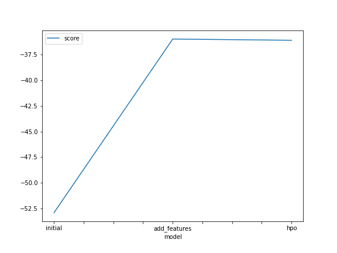
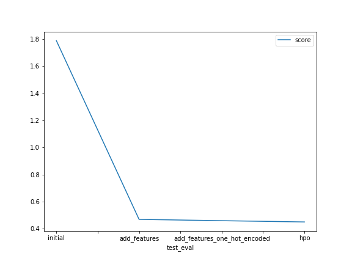

# Report: Predict Bike Sharing Demand with AutoGluon Solution
#### NAME HERE

## Initial Training
### What did you realize when you tried to submit your predictions? What changes were needed to the output of the predictor to submit your results?
- Before I submitted  have checked for negative values since Kaggle will reject the submissionn but in my case all the predicted values were positive so I haven't set any values to 0 before submission.

### What was the top ranked model that performed?
- WeightedEnsemble_L3 with score value of -52.921586.

## Exploratory data analysis and feature creation
### What did the exploratory analysis find and how did you add additional features?
- The data does not contain any outliers because the **min** and **max** values are not completely out of range from the **mean**.
- By plotting the histogram of each features we can see that the temp, atemp and windspeed features are somwhat a normalish data distribution.
- Working and holiday features are binary and can be categorized.
- Season and wheather features should also be categorized.

### Additional deatures
- Created new columns **Year**,  **Month**, **Day**, & **Hour** from the **DateTime** Column.
- Changed data types of **whether** and **season** features to **Category** type to increase the effectiveness of a model.
- One Hot Encode Whether and Season features.
- Drop the datetime feature as we already extracted useful features from it.

### How much better did your model preform after adding additional features and why do you think that is?
- The performance improved greately from a score of **1.78736** to **0.45953 **, which shows around ~75% Improvment.
- Our model performs better because we created a robust dataset by extracting and modifying the current features in the data set with additional insights or data. 

## Hyper parameter tuning
### How much better did your model preform after trying different hyper parameters?
- After performing hyperparameter optimization the score increases from  **0.45953 ** to **0.45035**, which shows around ~2% Improvment.

### If you were given more time with this dataset, where do you think you would spend more time?
- I would spend more time in Data cleansing & Feature engineering, Although Hyperparameter tuning is very important to improve your model, Autogluon have presets that are optimized to produce the best reasults.

### Create a table with the models you ran, the hyperparameters modified, and the kaggle score.
|model|time_limit|num_stack_levels|num_trials|score|
|--|--|--|--|--|
|initial|600||1|1|1.78736|
|add_features|600|1|1|0.45953|
|hpo|1200|3|10|0.45035|

### Create a line plot showing the top model score for the three (or more) training runs during the project.

TODO: Replace the image below with your own.

### Create a line plot showing the top kaggle score for the three (or more) prediction submissions during the project.

## Summary
In summery, The project showed how important Data Cleansing, Feature Engineering and Hyperparameter optimization are in the ML workflow to produce the  best accuracy.
And Also demonstrates the usefulness of autoML for quickly creating baseline and exploratory models.

